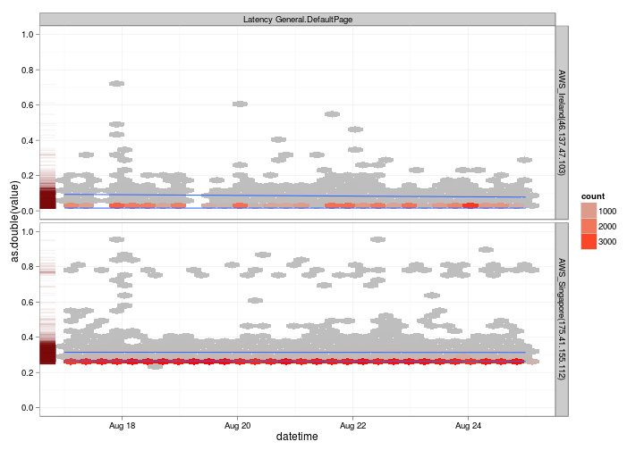
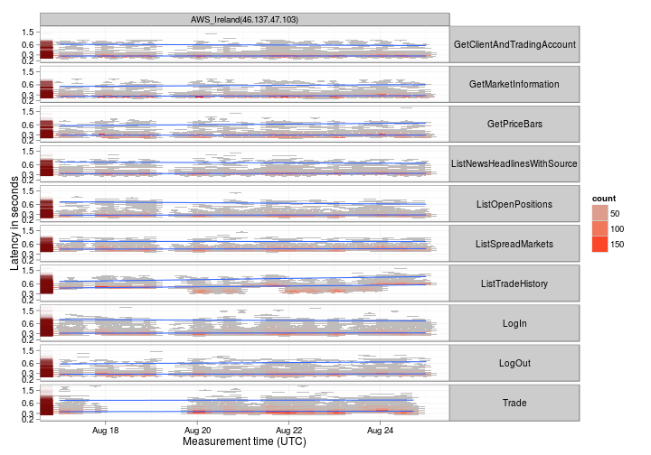
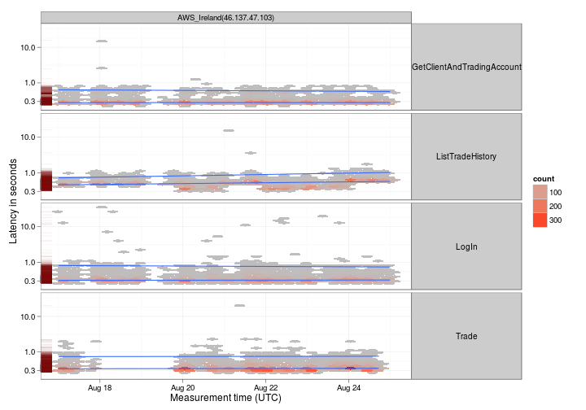

```
## Loading required package: bitops
```


Latency between different endpoints
-----------------------------------
The following chart compares the latency of the Default IIS page from different 
endpoints.  The IIS default page is assumed to be the fasted response the server can give, so this
measures the latency due to the network:

```r
rpc <- logdata[logdata$"key" %in% c("Latency General.DefaultPage"), ]
rpc$datetime <- strptime(rpc$timestamp, "%Y-%m-%d %H:%M:%S")
rpc <- join(rpc, nodes, by = "session", match = "first")

d <- ggplot(rpc, aes(x=datetime, y=as.double(value)))
d <- d + scale_y_continuous(limits=c(0.001, 1))
d <- d + geom_hex()
d <- d + stat_quantile( quantiles = c(0.5, 0.98) ) 
d <- d + geom_rug(aes(x=NULL, y=as.double(value)), col=rgb(.5,0,0, alpha=.05))
d <- d + scale_fill_gradient(low="grey", high="red") + theme_bw()
d <- d + facet_grid(nodeName ~ key)
print(d)
```

 

As is expected, both the latency measures and the variability is higher for nodes geographically further away.

It appears that there was a network connectivity issue between the CIAPI and the Ireland node on Aug 19th.

Latency between different services
-----------------------------------
The following graph compares the latency of different services for the same node:

```r
rpc2 <- logdata[logdata$"key" %in% c("Latency CIAPI.LogIn"
                                    ,"Latency CIAPI.LogOut"
                                    ,"Latency CIAPI.ListSpreadMarkets"
                                    ,"Latency CIAPI.GetClientAndTradingAccount"     
                                    ,"Latency CIAPI.GetMarketInformation"
                                    ,"Latency CIAPI.GetPriceBars"
                                    ,"Latency CIAPI.ListOpenPositions"
                                    ,"Latency CIAPI.ListNewsHeadlinesWithSource"
                                    ,"Latency CIAPI.ListTradeHistory"
                                    ,"Latency CIAPI.Trade" ), ]

rpc2$datetime <- strptime(rpc2$timestamp, "%Y-%m-%d %H:%M:%S")
rpc2$key <- sub('Latency CIAPI.', '',rpc2$key)
rpc2 <- join(rpc2, nodes, by = "session", match = "first")
rpc2 <- rpc2[rpc2$nodeName %in% c("AWS_Ireland(46.137.47.103)"),]

d <- ggplot(rpc2, aes(x=datetime, y=as.double(value)))
d <- d + ylab("Latency in seconds") + xlab("Measurement time (UTC)")
d <- d + scale_y_log10(breaks=c(0.2,0.3,0.6,1.5), limits=c(0.2, 2))
d <- d + geom_hex()
d <- d + stat_quantile( quantiles = c(0.5, 0.98) ) 
d <- d + geom_rug(aes(x=NULL, y=as.double(value)), col=rgb(.5,0,0, alpha=.05))
d <- d + scale_fill_gradient(low="grey", high="red") + theme_bw()
d <- d + facet_grid(key ~ nodeName)
d <- d + opts(strip.text.y = theme_text( angle=0))
print(d)
```

 


Latencies for different services are pretty similar, with the median being around 300ms and the 98th percentile being around 1 second.

Selective latencies in depth
-----------------------------------
The following graph compares:

1. GetClientAndTradingAccount - A "readonly" service query 
1. ListTradeHistory - A complex "readonly" query
1. Login - A simple "change server state" query
1. Trade - A complex "change server state" query


```r
rpc3 <- logdata[logdata$"key" %in% c("Latency CIAPI.LogIn"
                                    ,"Latency CIAPI.GetClientAndTradingAccount"   
                                    ,"Latency CIAPI.Trade"
                                    ,"Latency CIAPI.ListTradeHistory"), ]

rpc3$datetime <- strptime(rpc3$timestamp, "%Y-%m-%d %H:%M:%S")
rpc3$key <- sub('Latency CIAPI.', '',rpc3$key)
rpc3 <- join(rpc3, nodes, by = "session", match = "first")
rpc3 <- rpc3[rpc3$nodeName %in% c("AWS_Ireland(46.137.47.103)"),]

d <- ggplot(rpc3, aes(x=datetime, y=as.double(value)))
d <- d + ylab("Latency in seconds") + xlab("Measurement time (UTC)")
d <- d + scale_y_log10(breaks=c(0.3,1,10)) 
d <- d + geom_hex()
d <- d + stat_quantile( quantiles = c(0.5, 0.98) ) 
d <- d + geom_rug(aes(x=NULL, y=as.double(value)), col=rgb(.5,0,0, alpha=.05))
d <- d + scale_fill_gradient(low="grey", high="red") + theme_bw()
d <- d + facet_grid(key ~ nodeName)
d <- d + opts(strip.text.y = theme_text( angle=0))
print(d)
```

 


Both the median and 98th percentile latencies for ListTradeHistory gradually increase; which makes complete sense given that the amount of data transfered increases steadily as more trades are placed.

There isn't much difference between the other services - median latency is around 300 ms, with 98% of requests being serviced in less than 1 second.

Login has quite a few outliers, and no trades are placed when markets are closed (18th & 19th Aug is a weekend).


